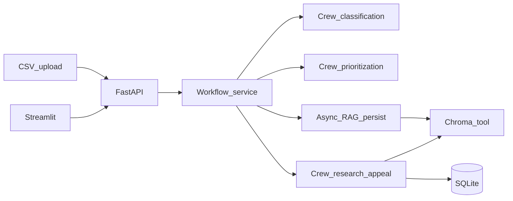

# DenialFlow AI (POC)

AI-native **healthcare denial resolution** platform: ingest denied claims, run a **CrewAI** multi-agent workflow (classification → prioritization → RAG → appeal drafting), pause for **human-in-the-loop** review, and surface **operational + financial metrics**.

> Synthetic demo data only. Not for production PHI processing.

## Architecture

- **Backend**: FastAPI (async IO + background workflow runs), SQLite (`aiosqlite`), structured logging (`structlog`), request correlation (`request_id` / `trace_id`), in-memory ops metrics.
- **Agents**: CrewAI crews for (1) denial classification, (2) financial prioritization, (3) research + appeal drafting (includes a **ChromaDB** retrieval tool).
- **RAG**: OpenAI embeddings + Chroma persistent store under `data/chroma/`.
- **Frontend**: Streamlit multi-page UI calling the REST API (decoupled like a real SaaS client).



## Quickstart

### 1) Create a virtualenv (recommended)

CrewAI pulls optional telemetry-related dependencies; using an **isolated venv** avoids conflicts with a global Anaconda install.

```bash
python -m venv .venv
.\.venv\Scripts\activate
python -m pip install -U pip
python -m pip install -r requirements.txt
```

### 2) Configure environment

Copy `.env.example` → `.env` and set `OPENAI_API_KEY`.

### 3) Generate demo CSV + seed the vector store

```bash
python scripts/generate_sample_csv.py
python scripts/seed_vectorstore.py
```

`seed_vectorstore.py` will chunk `data/seed_documents/*.md`, embed with `OPENAI_EMBEDDING_MODEL`, and upsert into Chroma collection `denialflow_corpus`.

### 4) Run API + UI

Terminal A:

```bash
python -m uvicorn denialflow_ai.api.app:app --reload --host 127.0.0.1 --port 8000
```

Terminal B:

```bash
set DENIALFLOW_API_BASE=http://127.0.0.1:8000
streamlit run streamlit_app/Home.py
```

Linux/macOS:

```bash
export DENIALFLOW_API_BASE=http://127.0.0.1:8000
streamlit run streamlit_app/Home.py
```

Open the Streamlit URL, then use **Upload → Workflow → Claims analysis → Appeal review**.

## CSV columns

Required: `claim_id`.

Clinical / financial (existing): `payer`, `denial_code`, `denial_reason_text`, `billed_amount`, `allowed_amount`, `patient_balance`, `aging_days`, `specialty`, `cpt_codes`, `icd10_codes`, `service_date`, `remark_codes`.

**Letterhead / cadastro** (optional; recommended so appeal drafts use real names and addresses instead of `[Your Company Name]` placeholders):

| Column | Description |
|--------|-------------|
| `provider_name` | Billing organization name |
| `provider_address` | Street address |
| `provider_city`, `provider_state`, `provider_zip` | Provider mailing city/state/ZIP |
| `signer_name`, `signer_title` | Signature block |
| `provider_npi` | NPI (optional) |
| `payer_address`, `payer_city`, `payer_state`, `payer_zip` | Payer mailing block (`payer` column = payer name) |
| `letter_date` | Letter date (ISO); if empty, workflow uses today |

Regenerate the demo file with letterhead: `python scripts/generate_sample_csv.py`.

## Example API payloads

### Start workflow

```json
POST /v1/workflows/run
{
  "batch_id": "<uuid from upload>",
  "max_claims": 3
}
```

### Human review

Appeal Review UI shows two separate opinions (vertical layout):

1. **1ª opinião** — appeal draft from CrewAI/Groq (workflow).
2. **Documentos RAG** — citations used in context.
3. **2ª opinião** — Bedrock analyzes the draft (on demand); does not replace the first.
4. **Human decision** — approve, edit, or reject. **Approve** and **edit** can trigger an e-mail with the final appeal text (Gmail API).

```json
POST /v1/appeals/<appeal_id>/ai-review
```

No body. Requires AWS credentials and `BEDROCK_MODEL_REVIEW` enabled in `.env`. Persists `ai_review_json` on the appeal.

```json
POST /v1/appeals/<appeal_id>/reject
{ "reason": "Insufficient documentation for policy section X." }
```

```json
POST /v1/appeals/<appeal_id>/edit
{ "final_text": "...", "reason": "Legal tone adjustment" }
```

**Bedrock (second opinion only)** — add to `.env`:

```env
AWS_REGION=us-east-1
BEDROCK_MODEL_REVIEW=anthropic.claude-3-5-sonnet-20241022-v2:0
BEDROCK_REVIEW_ENABLED=true
BEDROCK_REVIEW_USE_CREWAI=false
# Optional: use Groq when Bedrock daily token quota is exceeded
BEDROCK_REVIEW_FALLBACK_GROQ=false
```

Enable model access in the AWS Bedrock console for your region. The workflow still uses `LLM_PROVIDER=groq`; only `POST .../ai-review` calls Bedrock.

The second opinion sends the **appeal draft** (`draft_text`) plus **reference documents** from the knowledge base (Chroma embeddings): by default the RAG hits stored on the appeal (`citations_json`); set `BEDROCK_REVIEW_RAG_REFRESH=true` to re-query Chroma with the draft text. Classification and prioritization are not sent to Bedrock.

If you see `bedrock_quota_exceeded` / “Too many tokens”, the account hit Bedrock quota/throttle for that model in `AWS_REGION`. Wait for the UTC reset, request a quota increase under **Bedrock → Quotas**, switch `BEDROCK_MODEL_REVIEW`, or set `BEDROCK_REVIEW_FALLBACK_GROQ=true` (second opinion via Groq; `model_used` is prefixed with `groq-fallback:`).

More examples: [`examples/http/api.http`](examples/http/api.http).

### E-mail on human approve/edit (Gmail API / GCP)

When a reviewer **approves** or **submits an edit**, the API e-mails the same text saved as `final_text` to `GMAIL_TO`. **Reject** does not send e-mail.

**Personal Gmail** (e.g. `testescursor46@gmail.com`):

1. Enable **Gmail API** on your GCP project.
2. Create an **OAuth 2.0 Client ID** (type Web or Desktop), download JSON to `gcp/key_gmail.json` (gitignored).
3. In the OAuth client, add redirect URIs: `http://localhost:8080/` and `http://127.0.0.1:8080/`.
4. `.env`:

```env
GMAIL_NOTIFY_ENABLED=true
GMAIL_SERVICE_ACCOUNT_FILE=gcp/key_gmail.json
GMAIL_OAUTH_TOKEN_FILE=gcp/gmail_token.json
GMAIL_IMPERSONATE_USER=testescursor46@gmail.com
GMAIL_TO=testescursor46@gmail.com
```

5. One-time authorization (sign in as that Gmail account):

```bash
pip install google-auth-oauthlib
python scripts/gmail_authorize.py
```

6. Restart the API.

**Google Workspace** (service account): use a JSON key with `"type": "service_account"`, enable domain-wide delegation, set `GMAIL_IMPERSONATE_USER` to the mailbox to send as. OAuth token file is not used.

If sending fails, the appeal decision is still saved unless `GMAIL_FAIL_ON_ERROR=true`. Audit log: `email_sent`, `email_skipped`, or `email_failed`.

## Embeddings example (conceptual)

Each chunk is embedded with `text-embedding-3-small` (configurable) and stored in Chroma with metadata:

```json
{
  "id": "horizon_national_imaging_policy:2",
  "metadata": { "source": "horizon_national_imaging_policy.md", "title": "Horizon National Imaging Policy", "chunk": "2" },
  "document": "# Horizon National — Clinical Policy Memo..."
}
```

## Workflow states (persisted)

`pending → classified → prioritized → retrieved → awaiting_review → approved|rejected|edited`

## Production evolution (suggested)

- **Security / compliance**: RBAC, SSO, immutable audit storage, encryption at rest/in transit, BAA-aligned hosting, PHI boundary controls.
- **Scale**: queue (Celery/RQ/SQS), idempotent workflow steps, horizontal workers, secrets manager.
- **Quality**: offline eval sets, hallucination guardrails, citation verification, model routing by claim complexity.
- **Data**: Qdrant/Managed vector, document ingestion pipelines, de-identification tooling.

## Repo map

- `denialflow_ai/` — application code (API, services, crews, RAG, repos)
- `streamlit_app/` — Streamlit UI
- `data/seed_documents/` — synthetic policy + archived appeal snippets
- `scripts/` — dataset + vector seed utilities
- `tests/` — minimal unit tests

## License

POC / demonstration purposes.
