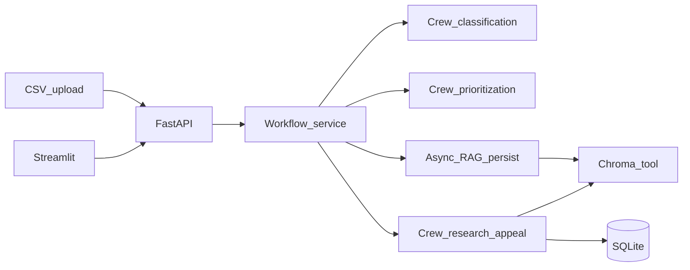

# DenialFlow AI (POC)

AI-native **healthcare denial resolution** platform: ingest denied claims, run a **CrewAI** multi-agent workflow (classification → prioritization → RAG → appeal drafting), pause for **human-in-the-loop** review, and surface **operational + financial metrics**.

> Synthetic demo data only. Not for production PHI processing.

## Architecture

- **Backend**: FastAPI (async IO + background workflow runs), SQLite (`aiosqlite`), structured logging (`structlog`), request correlation (`request_id` / `trace_id`), in-memory ops metrics.
- **Agents**: CrewAI crews for (1) denial classification, (2) financial prioritization, (3) research + appeal drafting (includes a **ChromaDB** retrieval tool).
- **RAG**: OpenAI embeddings + Chroma persistent store under `data/chroma/`.
- **Frontend**: Streamlit multi-page UI calling the REST API (decoupled like a real SaaS client).



## Quickstart

### 1) Create a virtualenv (recommended)

CrewAI pulls optional telemetry-related dependencies; using an **isolated venv** avoids conflicts with a global Anaconda install.

```bash
python -m venv .venv
.\.venv\Scripts\activate
python -m pip install -U pip
python -m pip install -r requirements.txt
```

### 2) Configure environment

Copy `.env.example` → `.env` and set `OPENAI_API_KEY`.

### 3) Generate demo CSV + seed the vector store

```bash
python scripts/generate_sample_csv.py
python scripts/seed_vectorstore.py
```

`seed_vectorstore.py` will chunk `data/seed_documents/*.md`, embed with `OPENAI_EMBEDDING_MODEL`, and upsert into Chroma collection `denialflow_corpus`.

### 4) Run API + UI

Terminal A:

```bash
python -m uvicorn denialflow_ai.api.app:app --reload --host 127.0.0.1 --port 8000
```

Terminal B:

```bash
set DENIALFLOW_API_BASE=http://127.0.0.1:8000
streamlit run streamlit_app/Home.py
```

Linux/macOS:

```bash
export DENIALFLOW_API_BASE=http://127.0.0.1:8000
streamlit run streamlit_app/Home.py
```

Open the Streamlit URL, then use **Upload → Workflow → Claims analysis → Appeal review**.

## Example API payloads

### Start workflow

```json
POST /v1/workflows/run
{
  "batch_id": "<uuid from upload>",
  "max_claims": 3
}
```

### Human review

```json
POST /v1/appeals/<appeal_id>/reject
{ "reason": "Insufficient documentation for policy section X." }
```

```json
POST /v1/appeals/<appeal_id>/edit
{ "final_text": "...", "reason": "Legal tone adjustment" }
```

More examples: [`examples/http/api.http`](examples/http/api.http).

## Embeddings example (conceptual)

Each chunk is embedded with `text-embedding-3-small` (configurable) and stored in Chroma with metadata:

```json
{
  "id": "horizon_national_imaging_policy:2",
  "metadata": { "source": "horizon_national_imaging_policy.md", "title": "Horizon National Imaging Policy", "chunk": "2" },
  "document": "# Horizon National — Clinical Policy Memo..."
}
```

## Workflow states (persisted)

`pending → classified → prioritized → retrieved → awaiting_review → approved|rejected|edited`

## Production evolution (suggested)

- **Security / compliance**: RBAC, SSO, immutable audit storage, encryption at rest/in transit, BAA-aligned hosting, PHI boundary controls.
- **Scale**: queue (Celery/RQ/SQS), idempotent workflow steps, horizontal workers, secrets manager.
- **Quality**: offline eval sets, hallucination guardrails, citation verification, model routing by claim complexity.
- **Data**: Qdrant/Managed vector, document ingestion pipelines, de-identification tooling.

## Repo map

- `denialflow_ai/` — application code (API, services, crews, RAG, repos)
- `streamlit_app/` — Streamlit UI
- `data/seed_documents/` — synthetic policy + archived appeal snippets
- `scripts/` — dataset + vector seed utilities
- `tests/` — minimal unit tests

## License

POC / demonstration purposes.
