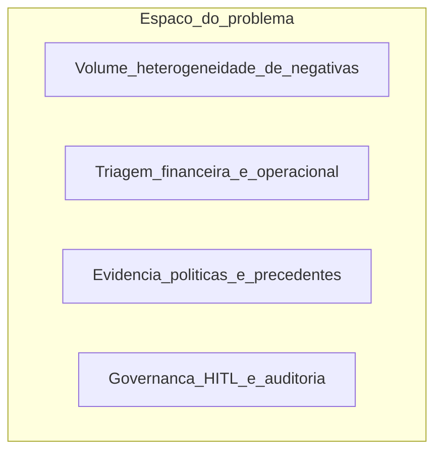
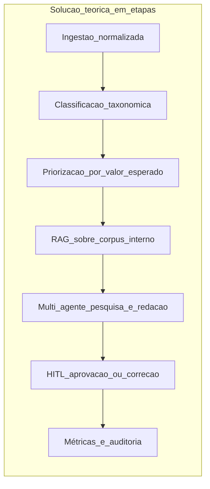
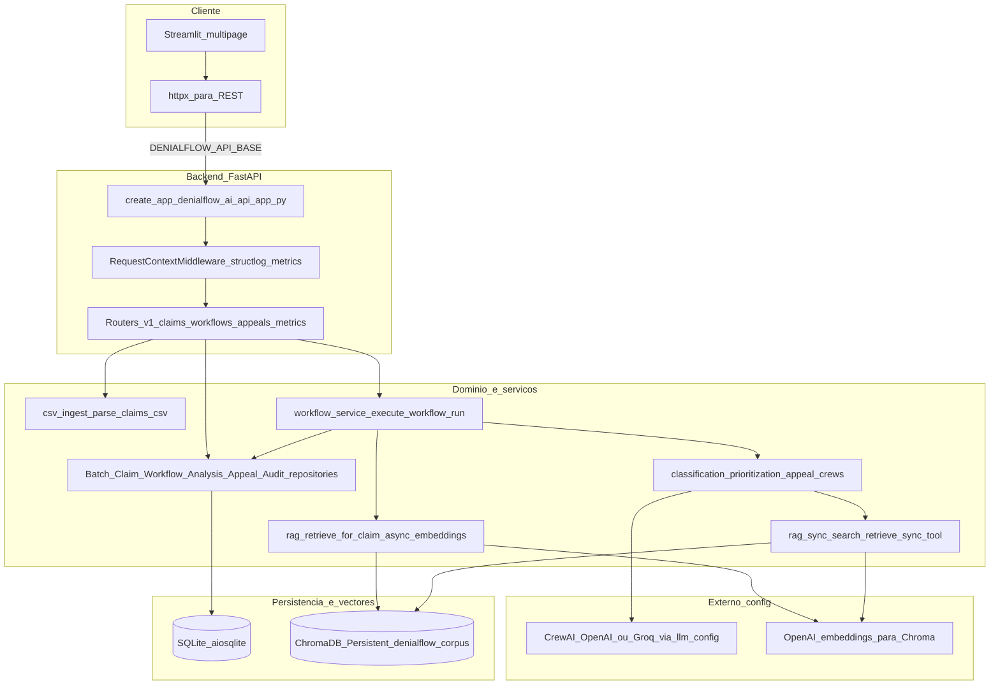
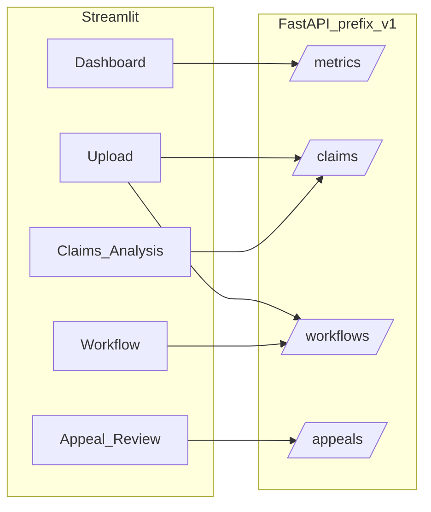
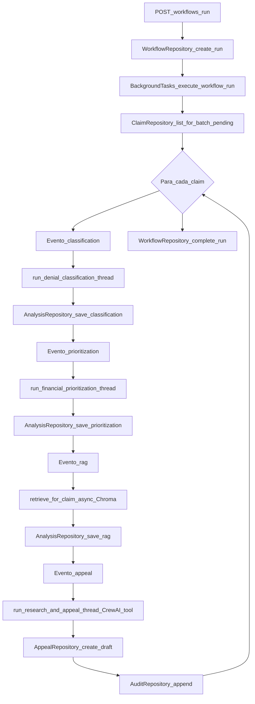
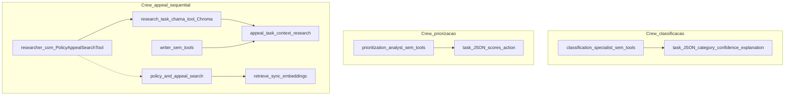
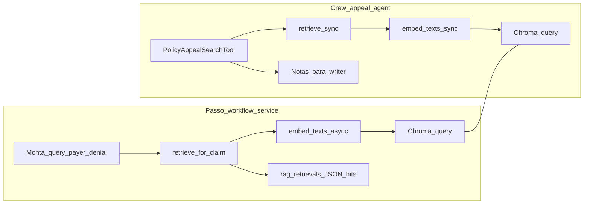

# Diagrama da arquitetura DenialFlow AI

Este repositório é uma POC de **resolução de negativas de saúde**: ingestão CSV de claims negadas, pipeline multi-etapa com agentes (CrewAI), pausa para **human-in-the-loop** nas contests, e métricas operacionais/financeiras.

## Enquadramento teórico: estrutura do problema

No **ciclo de receitas em saúde (RCM)**, uma **negativa (denial)** é a recusa ou redução do pagamento de um pedido de reembolso, frequentemente acompanhada de códigos, texto livre do pagador e dados clínicos/administrativos. Em escala empresarial, o problema estrutura-se assim:

- **Alto volume e heterogeneidade**: cada linha de negativa mistura sinais estruturados (valores, datas, CPT/ICD, códigos de remark) e texto não estruturado (justificativa do pagador). O mesmo sintoma financeiro pode corresponder a causas diferentes (autorização, medical necessity, codificação, duplicidade, documentação).
- **Decisão sob incerteza e custo de oportunidade**: nem toda contestação vale o mesmo esforço; há trade-off entre recuperação esperada, prazo de aging e probabilidade de reversão. Sem triagem, equipes gastam tempo em casos de baixo retorno ou desistem cedo dos mais lucrativos.
- **Argumentação dependente de evidência**: uma contestação convincente deve alinhar fatos da reclamação a políticas contratuais, memorandos clínicos e precedentes internos — informação dispersa e volátil. **Alucinar política ou jurisprudência interna** é um risco operacional e de conformidade.
- **Governança e auditoria**: decisões sobre texto enviado ao pagador costumam exigir revisão humana, registro de quem aprovou/editou/rejeitou e rastreabilidade por pedido (`claim`) e execução de fluxo (`workflow run`).

Em termos de **modelagem**, pode-se ver cada negativa como um **caso de decisão sequencial**: primeiro interpretar e rotular o tipo de problema (função de classificação); depois ordenar ou filtrar por valor esperado (função de priorização); em seguida reunir evidências de um corpus organizacional (recuperação semântica / RAG); por fim gerar um artefato linguístico (carta de contestação) sujeito a **gate humano**.

## Solução teórica (conceito antes da implementação)

A solução adotada neste projeto espelha uma **decomposição cognitiva** do trabalho de um analista sênior de RCM em etapas especializadas, automatizadas onde faz sentido e **pausadas** onde o risco reputacional/regulatório é alto:

1. **Normalização e ingestão**: concentrar registros negados num formato único (aqui, CSV → linhas em base relacional), preservando payload bruto para auditoria e campos derivados para os agentes.
2. **Classificação semântica**: mapear a narrativa da negativa para uma **taxonomia canónica** de causas (ex.: autorização, medical necessity, codificação). Isto reduz o espaço de estratégias e permite relatórios consistentes.
3. **Priorização financeira**: estimar scores de urgência, recuperação esperada e probabilidade de reversão para ordenar o trabalho humano e de modelo — alinhado à ideia de **maximizar valor esperado** sob restrição de capacidade.
4. **Fundamentação por recuperação aumentada (RAG)**: antes de redigir, **consultar um índice vetorial** sobre políticas e appeals históricos sintéticos, para ancorar argumentos em trechos recuperados em vez de memória implícita do modelo.
5. **Redação assistida multi-agente**: separar **pesquisador** (usa ferramenta de busca no corpus) e **autor** (redige com base nas notas), reduzindo a mistura de “inventar fonte” com “escrever texto”.
6. **Human-in-the-loop (HITL)**: o sistema para em **awaiting_review**; humanos **aprovar**, **rejeitar com motivo** ou **editar** o texto final. O estado da reclamação e o **audit log** fecham o ciclo de responsabilização.
7. **Observabilidade**: métricas agregadas (filas, tempo de run, KPIs financeiros proxy) para operação da POC e correlacionamento por `request_id`/`trace_id`.

**Correspondência problema ↔ solução (resumo)**

- Incerteza sobre o “tipo” de negativa → **classificação supervisionada por LLM** com saída estruturada (JSON) e cache opcional.
- Capacidade limitada da equipa → **priorização explícita** antes da redação custosa.
- Risco de claims infundadas → **RAG + instruções anti-fabricação** na equipa de appeal e persistência das citações recuperadas.
- Necessidade de controlo humano → **API de revisão** e estados terminais `approved` / `rejected` / `edited`.

Na implementação deste repositório, estas etapas teóricas materializam-se nos artefactos já descritos abaixo (FastAPI, `workflow_service`, repositórios SQLite, Chroma, crews CrewAI e páginas Streamlit).

## Visão em camadas (contexto do sistema)

Pontos-chave:

- Entrada principal da API: [`denialflow_ai/api/app.py`](denialflow_ai/api/app.py) (`create_app`, lifespan com `init_database`, CORS, middleware).
- Dependência de DB por request: [`denialflow_ai/api/deps.py`](denialflow_ai/api/deps.py) (`db_conn` → `get_connection`).
- UI não acessa SQLite/Chroma diretamente; apenas HTTP para `/v1/...`.

## Rotas REST e páginas Streamlit

| Área | Endpoints principais | Uso no Streamlit |
|------|---------------------|------------------|
| Claims | `POST /v1/claims/upload`, `GET /v1/claims`, `GET /v1/claims/summary` | [`streamlit_app/pages/2_Upload.py`](streamlit_app/pages/2_Upload.py), [`4_Claims_Analysis.py`](streamlit_app/pages/4_Claims_Analysis.py) |
| Workflows | `POST /v1/workflows/run`, `GET /v1/workflows/...`, events | [`3_Workflow.py`](streamlit_app/pages/3_Workflow.py) |
| Appeals HITL | `GET /v1/appeals`, detail, approve/reject/edit | [`5_Appeal_Review.py`](streamlit_app/pages/5_Appeal_Review.py) |
| Métricas | `GET /v1/metrics/dashboard`, `/ops` | [`1_Dashboard.py`](streamlit_app/pages/1_Dashboard.py) |

## Pipeline de workflow (coração do negócio)

O arranque é **assíncrono**: [`denialflow_ai/api/routers/workflows.py`](denialflow_ai/api/routers/workflows.py) cria um `workflow_run`, incrementa métricas e agenda `execute_workflow_run` como `BackgroundTasks`.

O serviço [`denialflow_ai/services/workflow_service.py`](denialflow_ai/services/workflow_service.py) abre **sua própria** conexão SQLite (não a do request), lista claims `pending` do batch e, **por claim**, executa:

1. **Classificação** — `asyncio.to_thread(run_denial_classification)` → persiste em `classification_results`, status `classified`.
2. **Priorização financeira** — `run_financial_prioritization` → `prioritization_results`, status `prioritized`.
3. **RAG assíncrono** — `retrieve_for_claim(query)` persiste hits em `rag_retrievals`, status `retrieved` (fallback de query se falhar).
4. **Pesquisa + carta** — `run_research_and_appeal` (Crew com tool) → `appeals` como rascunho, status `awaiting_review`, evento HITL.

Há **orçamento de tokens** aproximado (`workflow_token_budget` em settings): se estourar, o batch para com evento `budget`.

Estados de claim (persistidos): fluxo descrito no README — `pending → classified → prioritized → retrieved → awaiting_review → approved|rejected|edited` após ações humanas em [`denialflow_ai/api/routers/appeals.py`](denialflow_ai/api/routers/appeals.py).

## CrewAI: configuração LLM, agentes, tarefas e ferramentas

Toda a orquestração CrewAI está em [`denialflow_ai/crews/`](denialflow_ai/crews/) e usa **`Process.sequential`** e `verbose=False`. O LLM injetado nos agentes vem de [`denialflow_ai/crews/llm_config.py`](denialflow_ai/crews/llm_config.py):

- **`build_llm(model, temperature)`** — instancia `crewai.LLM`: se `llm_provider` (settings) for **`groq`**, usa modelo no formato `groq/<id>` (ex.: `groq/llama-3.3-70b-versatile`); caso contrário **`openai/<id>`**.
- **`kickoff_crew_with_model_fallback`** — quando o provider é Groq, tenta **`crew.kickoff()`** ao longo de uma **cadeia de modelos** (`groq_model_chain`: primário, fallback e opcionalmente modelo dedicado a appeal); em falha iterativa, passa ao seguinte. Para **Llama 3.3 70B** há **`with_groq_70b_rate_limit_retry`** (até 3 retries com pausa de 2 s em erros de rate limit detectados via LiteLLM/`rate_limit_exceeded`).
- **`ensure_openai_env` / `ensure_groq_env`** — propagam API keys das settings para variáveis de ambiente esperadas pelos backends.

Os três crews são invocados pelo workflow **em thread** (`asyncio.to_thread`), porque `kickoff()` é bloqueante.

### Ferramenta CrewAI (única no projeto)

| Campo | Valor |
|-------|--------|
| Classe | [`PolicyAppealSearchTool`](denialflow_ai/tools/rag_tool.py) (`crewai.tools.BaseTool`) |
| `name` | `policy_and_appeal_search` |
| `description` | Busca políticas de pagador e appeals/arquivos internos relevantes à negativa; entrada = pergunta NL com contexto de código/motivo. |
| Execução | `_run(question)` → [`retrieve_sync`](denialflow_ai/rag/sync_search.py)(`question`, `top_k=6`) → devolve JSON serializado (`RagRetrievalResult.model_dump_json()`). |

Nenhum outro agente declara `tools=[...]`; classificação e priorização são **só LLM + prompt estruturado**.

### Crew A — Classificação ([`classification.py`](denialflow_ai/crews/classification.py))

| Elemento | Detalhe |
|----------|---------|
| Função exposta | `run_denial_classification(claim_payload) → (ClassificationResult, model_label)` |
| Agentes | **1** — *Denial classification specialist* (`goal`: mapear narrativa do pagador para **uma** categoria canónica com confiança calibrada e explicação auditável; `backstory`: analista RCM US senior, só factos do claim, sem citar políticas inventadas). |
| Ferramentas | Nenhuma. |
| Task | Classificar o record JSON/texto do claim; saída **apenas JSON** com chaves `category`, `confidence`, `explanation`. |
| Categorias permitidas | `coding_issue`, `authorization`, `duplicate_claim`, `medical_necessity`, `incomplete_documentation`. |
| Temperatura LLM | `0.1`. |
| Cache | [`get_classification_cache`](denialflow_ai/rag/__init__.py) (TTL em settings): hit devolve modelo `"cache"`. |
| Fallback | Se Crew falhar: cliente direto [`get_llm_client().chat_json`](denialflow_ai/llm/) → parse `ClassificationResult`; label `"llm_fallback_json"`. |

### Crew B — Priorização financeira ([`prioritization.py`](denialflow_ai/crews/prioritization.py))

| Elemento | Detalhe |
|----------|---------|
| Função exposta | `run_financial_prioritization(claim_payload, classification_summary) → (PrioritizationResult, model_label)` |
| Agentes | **1** — *RCM financial prioritization analyst* (`goal`: quantificar impacto financeiro, urgência, probabilidade de reversão e próxima ação operacional; `backstory`: mistura raciocínio actuarial com playbooks RCM, outputs numéricos, sem PHI extra). |
| Ferramentas | Nenhuma. |
| Task | Priorizar usando claim + resumo da classificação; saída **apenas JSON** com `priority_score` (0–100), `estimated_recoverable_revenue`, `urgency`, `reversal_probability`, `recommended_action`. |
| Temperatura LLM | `0.15`. |
| Fallback | Igual ao crew A via `chat_json` → `PrioritizationResult`; label `"llm_fallback_json"`. |

### Crew C — Pesquisa interna + redação de contestação ([`appeal.py`](denialflow_ai/crews/appeal.py))

| Elemento | Detalhe |
|----------|---------|
| Função exposta | `run_research_and_appeal(claim_payload, classification_summary, prioritization_summary) → (appeal_markdown, confidence_float, model_label)` |
| Agentes | **2** — (1) *Internal policy and precedent researcher*: `tools=[PolicyAppealSearchTool()]`, `allow_delegation=False`; (2) *Appeal letter author*: sem tools, `allow_delegation=False`. |
| Tasks | **research_task** (researcher): investigar precedentes; instrução explícita para **chamar a tool** com pergunta focada (código/motivo) e resumir hits com **doc_ids** e relevância. **appeal_task** (writer): redigir carta enterprise RCM; **`context=[research_task]`** para encadear output da pesquisa; deve terminar com linha **`CONFIDENCE: 0.##`** (dois decimais). |
| Processo | Sequencial: pesquisa → redação (dependência formal via `context`). |
| Temperatura LLM | `0.25`. |
| Pós-processamento | Percorre linhas do texto para parsear `CONFIDENCE:`; default **0.55** se ausente/inválido; valor clampado a `[0, 1]`. |
| Fallback | Se Crew falhar: [`get_llm_client().appeal_text`](denialflow_ai/llm/) (async executado com `asyncio.run`) com o mesmo trio de inputs. |

## Dois caminhos RAG (importante para o diagrama mental)

- **Pipeline (`retrieve_for_claim`)**: embeddings **async** em [`denialflow_ai/rag/__init__.py`](denialflow_ai/rag/__init__.py); resultado serializado e gravado como contexto/citações para o appeal draft no SQLite.
- **Tool CrewAI (`PolicyAppealSearchTool`)**: chama [`denialflow_ai/rag/sync_search.py`](denialflow_ai/rag/sync_search.py) (`retrieve_sync`, embeddings síncronos) porque a tool roda no mesmo mundo síncrono do agente — ver [`denialflow_ai/tools/rag_tool.py`](denialflow_ai/tools/rag_tool.py) e [`denialflow_ai/crews/appeal.py`](denialflow_ai/crews/appeal.py).

Ambos consultam a mesma coleção Chroma `denialflow_corpus` sob `data/chroma/` (config em [`denialflow_ai/core/config.py`](denialflow_ai/core/config.py)).

## Observabilidade e configuração

- [`denialflow_ai/observability/middleware.py`](denialflow_ai/observability/middleware.py): `x-request-id`, `trace_id`, contadores e latência via [`get_metrics()`](denialflow_ai/observability/__init__.py) (usado também em [`denialflow_ai/api/routers/metrics.py`](denialflow_ai/api/routers/metrics.py)).
- Logging estruturado no startup (`configure_logging` no lifespan).

## Modelo de dados SQLite (resumo)

Definido em [`denialflow_ai/db/__init__.py`](denialflow_ai/db/__init__.py): `batches`, `claims`, `workflow_runs`, `workflow_events`, `classification_results`, `prioritization_results`, `rag_retrievals`, `appeals`, `audit_log`.

## Scripts auxiliares (fora do runtime da API)

- [`scripts/generate_sample_csv.py`](scripts/generate_sample_csv.py) — CSV de demo.
- [`scripts/seed_vectorstore.py`](scripts/seed_vectorstore.py) — chunk de `data/seed_documents/*.md` → embeddings → Chroma.

---

**O que este plano agrega:** enquadramento teórico do problema de negativas em saúde e da solução por etapas (decomposição, RAG, multi-agente, HITL), seguido dos diagramas da arquitetura de implementação. Opcionalmente, pode consolidar secções escolhidas no [`README.md`](README.md).
