# DenialFlow AI (EVA) — Documentação completa dos fluxos

**Versão:** POC · **Data:** maio/2026  
**Escopo:** FastAPI, CrewAI, AWS Bedrock, RAG (Chroma + OpenAI), Streamlit, Gmail, AgentOps, SQLite.

---

## Sumário executivo

O **DenialFlow AI** é uma plataforma de demonstração para resolução de **negativas de saúde** (RCM). O fluxo operacional é:

1. **Ingestão** — upload de CSV com claims negadas → SQLite (`pending`).
2. **Automação** — workflow em background: classificação → priorização → RAG → carta de recurso (CrewAI) → `awaiting_review`.
3. **Conhecimento** — corpus vetorial em Chroma (`denialflow_corpus`), alimentado por `seed_vectorstore.py`.
4. **Revisão humana (HITL)** — Streamlit: segunda opinião opcional (Bedrock), approve / edit / reject.
5. **Notificação** — Gmail API em approve/edit (opcional).
6. **Visibilidade** — dashboard de métricas, eventos de workflow, AgentOps (opcional).

> Dados sintéticos apenas. Não processar PHI em produção sem controles de compliance.

---

## 1. Visão geral da arquitetura

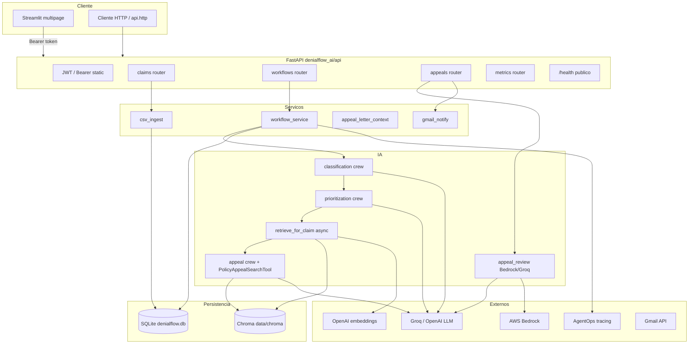

### Pontos de entrada

| Componente | Comando | Papel |
|------------|---------|-------|
| API | `uvicorn denialflow_ai.api.app:app` | `create_app()` em `denialflow_ai/api/app.py` |
| UI | `streamlit run streamlit_app/Home.py` | Cliente REST desacoplado |
| Seed RAG | `python scripts/seed_vectorstore.py` | Popula Chroma com `data/seed_documents/*.md` |
| Token JWT | `python scripts/generate_api_token.py` | Gera `API_ACCESS_TOKEN` para `.env` |

### Stack tecnológica

| Camada | Tecnologia | Uso |
|--------|------------|-----|
| API HTTP | **FastAPI** + Uvicorn | Rotas REST `/v1/*`, background tasks, lifespan |
| Agentes | **CrewAI** | Crews sequenciais: classificação, priorização, apelação |
| LLM workflow | **Groq** ou **OpenAI** (`LLM_PROVIDER`) | Classificação, priorização, carta via `llm_config.py` |
| LLM 2ª opinião | **AWS Bedrock** (Claude via LiteLLM) | `POST /v1/appeals/{id}/ai-review` |
| Embeddings | **OpenAI** `text-embedding-3-small` | RAG async + sync |
| Vetor | **ChromaDB** persistente | Coleção `denialflow_corpus` em `data/chroma/` |
| DB relacional | **SQLite** + aiosqlite | Claims, batches, appeals, audit, workflow_runs |
| UI | **Streamlit** | 5 páginas + Home |
| E-mail | **Gmail API** (OAuth ou service account) | Após approve/edit |
| Observabilidade | **AgentOps** + structlog | Traces por workflow e ai-review |
| Auth | **JWT** + token estático | Bearer em todas as rotas `/v1/*` |

---

## 2. Inicialização da API (lifespan FastAPI)

Ao subir o Uvicorn, o `lifespan` de `create_app()` executa:

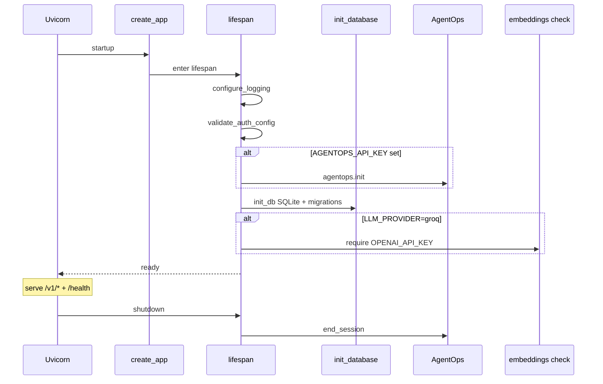

**Middleware em cada request:** `RequestContextMiddleware` (request_id, trace_id, latência) + CORS permissivo (`*`).

**Arquivos:** `denialflow_ai/api/app.py`, `denialflow_ai/core/logging.py`, `denialflow_ai/observability/middleware.py`.

---

## 3. Autenticação (rotas `/v1/*`)

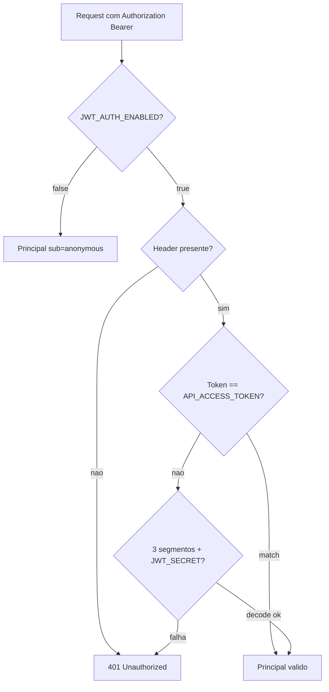

- **Público:** apenas `GET /health`
- **Protegido:** routers com `Depends(get_current_principal)`
- **HITL:** `approve` / `reject` / `edit` gravam `principal["sub"]` no `audit_log`
- **Implementação:** `denialflow_ai/api/auth.py`, `denialflow_ai/api/deps.py`

---

## 4. Fluxo operacional end-to-end (POC)

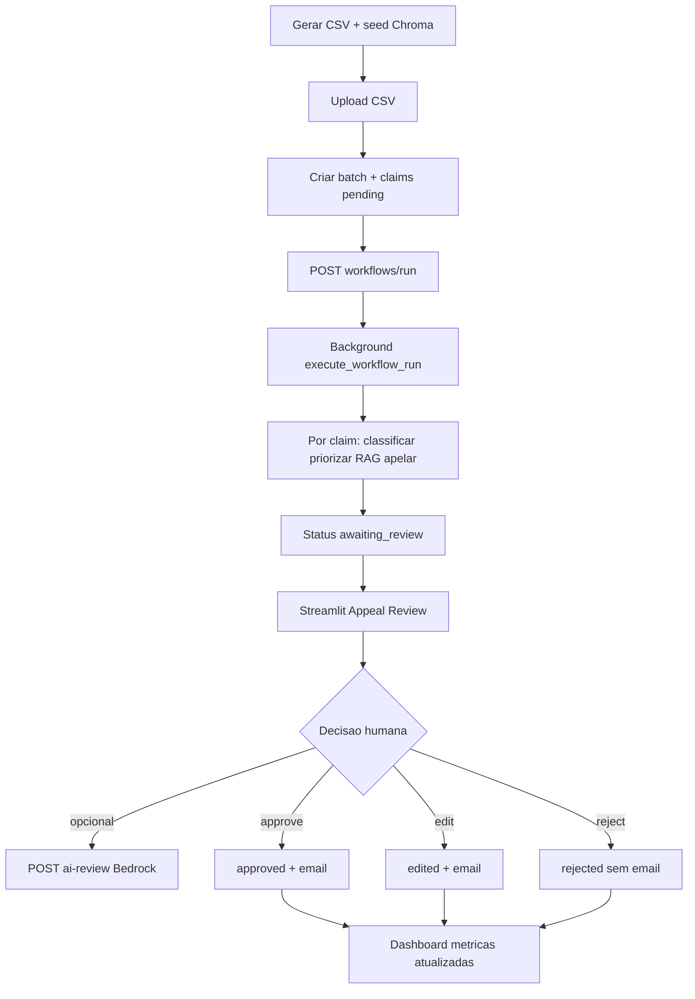

### Estados do claim (SQLite)

`pending` → `classified` → `prioritized` → `retrieved` → `awaiting_review` → `approved` | `rejected` | `edited`

---

## 5. Upload de CSV

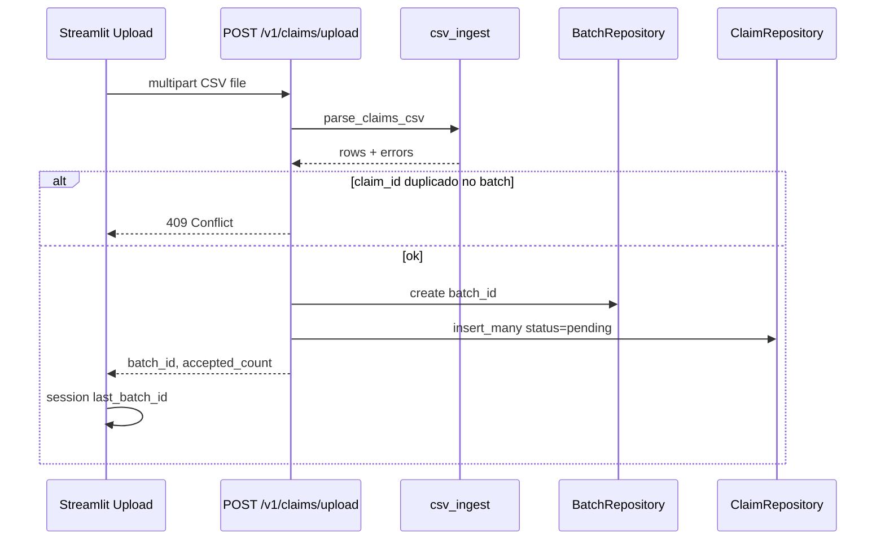

**Colunas obrigatórias:** `claim_id`.  
**Clínico/financeiro:** `payer`, `denial_code`, valores, CPT/ICD, etc.  
**Letterhead (opcional):** `provider_name`, endereços, `signer_name` — evita placeholders `[Your Company Name]` na carta.

**Arquivos:** `denialflow_ai/api/routers/claims.py`, `streamlit_app/pages/2_Upload.py`.

---

## 6. Workflow — núcleo do sistema

### 6.1 Disparo e monitoramento

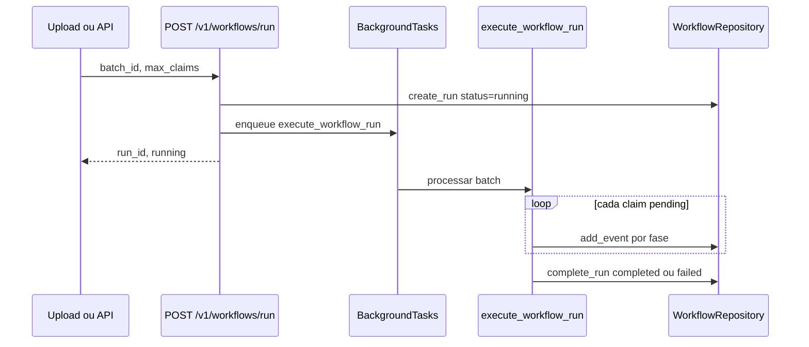

**Monitoramento:** `streamlit_app/pages/3_Workflow.py` — polling `GET /v1/workflows/{id}`, eventos, auto-refresh 5s.

### 6.2 Pipeline por claim (detalhado)

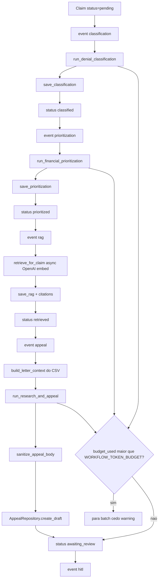

**Implementação central:** `denialflow_ai/services/workflow_service.py`.

**Orçamento de tokens:** estimativa grosseira (`len(text)//4`); ao exceder `WORKFLOW_TOKEN_BUDGET`, o batch para cedo com warning no log de eventos.

---

## 7. Crews CrewAI (agentes)

### 7.1 Classificação de negativa

| Item | Detalhe |
|------|---------|
| Arquivo | `denialflow_ai/crews/classification.py` |
| Entrada | JSON do claim (`_claim_text`) |
| Saída | `category`, `confidence`, `explanation` |
| Categorias | `coding_issue`, `authorization`, `duplicate_claim`, `medical_necessity`, `incomplete_documentation` |
| Sequência | 1 agente → 1 task → JSON |
| Cache | TTL em memória por hash do payload |
| Fallback | `chat_json` direto se o crew falhar |

### 7.2 Priorização financeira

| Item | Detalhe |
|------|---------|
| Arquivo | `denialflow_ai/crews/prioritization.py` |
| Entrada | claim JSON + resumo da classificação |
| Saída | `priority_score`, `estimated_recoverable_revenue`, `urgency`, `reversal_probability`, `recommended_action` |
| Sequência | 1 agente → 1 task com `output_pydantic` |

### 7.3 Pesquisa + carta de recurso (Crew C)

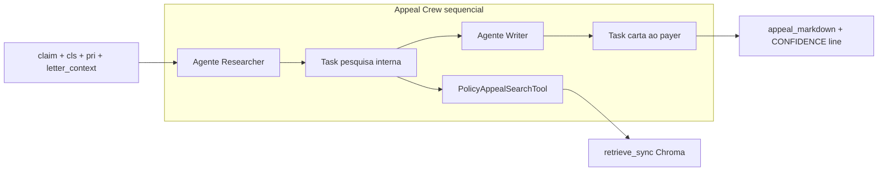

- **Tool RAG:** `denialflow_ai/tools/rag_tool.py` — busca síncrona no corpus
- **Regras:** sem placeholders `[...]`; `doc_id` só em notas internas
- **Citações no DB:** do RAG **async** do workflow (passo 3), não necessariamente dos hits da tool
- **Fallback:** `appeal_text()` via LLM sem tool

### 7.4 Segunda opinião — AWS Bedrock (fora do workflow)

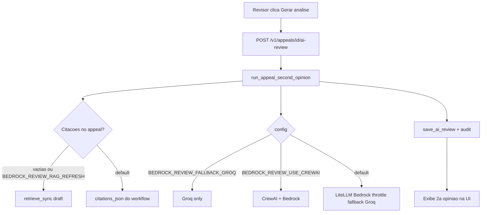

**Importante:** a 2ª opinião **não altera** o status do claim automaticamente. O workflow principal continua em Groq/OpenAI; Bedrock é só em `ai-review`.

**Variáveis `.env` relevantes:**

- `AWS_REGION`, `BEDROCK_MODEL_REVIEW`, `BEDROCK_REVIEW_ENABLED`
- `BEDROCK_REVIEW_USE_CREWAI` — usar CrewAI com LLM Bedrock vs LiteLLM direto
- `BEDROCK_REVIEW_FALLBACK_GROQ` — quota Bedrock excedida → Groq
- `BEDROCK_REVIEW_RAG_REFRESH` — re-buscar Chroma com texto do draft

**Arquivo:** `denialflow_ai/crews/appeal_review.py`  
**UI:** `streamlit_app/pages/5_Appeal_Review.py`

### 7.5 LLM compartilhado (`llm_config.py`)

- `LLM_PROVIDER`: `groq` ou `openai`
- Cadeia de fallback de modelos Groq
- `kickoff_crew_with_model_fallback` + contexto AgentOps por kickoff
- Bedrock via LiteLLM para review (`build_llm_bedrock`, `ensure_bedrock_env`)

---

## 8. Fluxo RAG (duas vias)

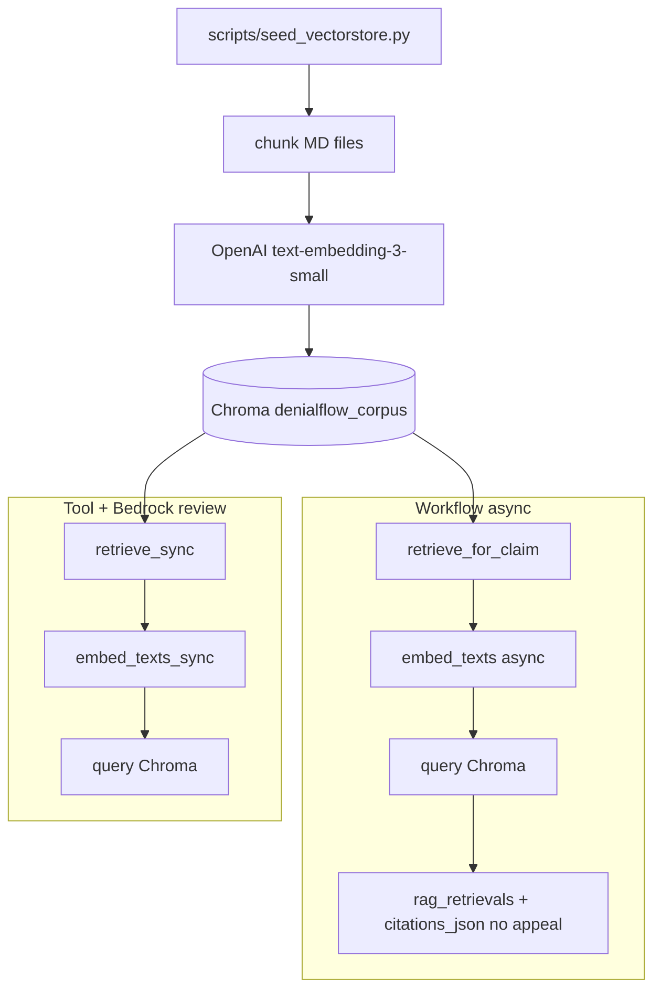

| Via | Função | Quando |
|-----|--------|--------|
| **Async** | `retrieve_for_claim` | Passo 3 do workflow; persiste citações no appeal |
| **Sync** | `retrieve_sync` | `PolicyAppealSearchTool` no Crew C; refresh Bedrock review |

Diretório: `data/chroma/` · documentos: `data/seed_documents/*.md`.

---

## 9. HITL — revisão humana de appeals

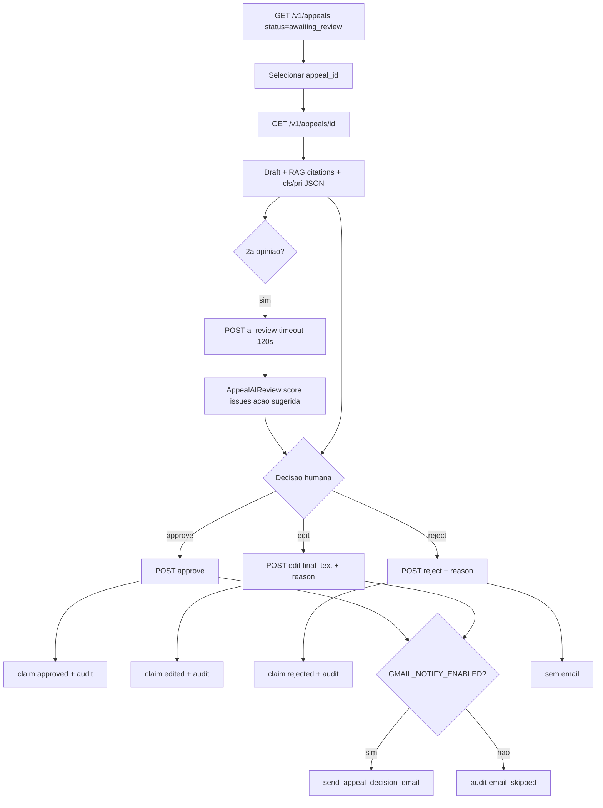

**Gmail** (`denialflow_ai/services/gmail_notify.py`): OAuth (`gcp/key_gmail.json` + `gmail_token.json`) ou service account Workspace. Falha de e-mail **não reverte** a decisão salva (exceto `GMAIL_FAIL_ON_ERROR=true` → HTTP 502).

**Sanitização da carta:** `denialflow_ai/services/appeal_letter_context.py`.

---

## 10. Jornada Streamlit (UI)

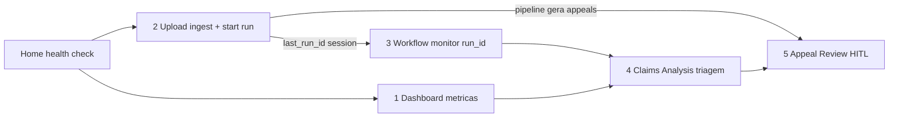

| Página | Ações | API |
|--------|-------|-----|
| `Home.py` | URL da API, saúde | `GET /health` (sem auth) |
| `1_Dashboard.py` | KPIs | `GET /v1/metrics/dashboard`, `/ops` |
| `2_Upload.py` | CSV + workflow | `POST /v1/claims/upload`, `POST /v1/workflows/run` |
| `3_Workflow.py` | Run ID, auto-refresh | `GET /v1/workflows/*` |
| `4_Claims_Analysis.py` | Filtro status | `GET /v1/claims/summary` |
| `5_Appeal_Review.py` | Bedrock + HITL | `GET/POST /v1/appeals/*` |

Cliente: `streamlit_app/api_client.py` — Bearer `API_ACCESS_TOKEN` do `.env`.

---

## 11. Métricas e observabilidade

### Dashboard (`GET /v1/metrics/dashboard`)

Agrega SQLite: total claims, proxy taxa negação, receita recuperável, fila `awaiting_review`, duração média de runs, top 10 prioridade.

### Ops in-memory (`GET /v1/metrics/ops`)

Latências e contadores do middleware (não persiste em DB).

### AgentOps

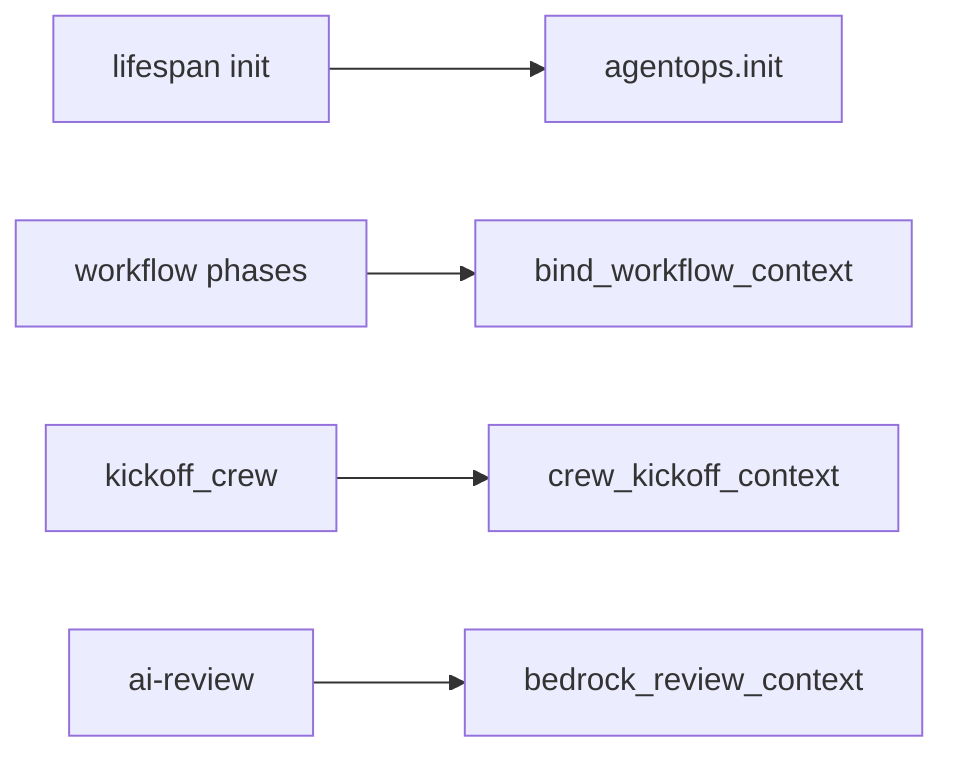

Módulo: `denialflow_ai/observability/agentops_client.py`.

---

## 12. Modelo de dados (SQLite)

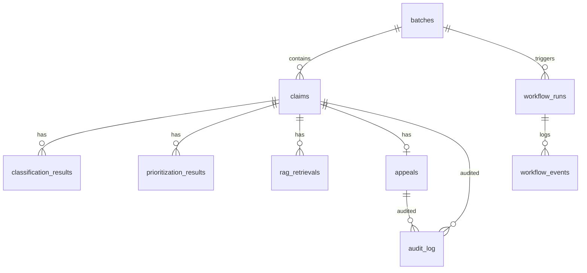

Repositórios: `denialflow_ai/repositories/` · schema: `denialflow_ai/db/`. **Chroma é separado** do SQLite.

---

## 13. Mapa da API REST

| Método | Caminho | Função |
|--------|---------|--------|
| GET | `/health` | Liveness (público) |
| POST | `/v1/claims/upload` | Ingestão CSV |
| GET | `/v1/claims` | Lista com filtro `status` |
| GET | `/v1/claims/summary` | Join claim + análises + appeal |
| POST | `/v1/workflows/run` | Inicia run em background |
| GET | `/v1/workflows` | Runs recentes |
| GET | `/v1/workflows/{run_id}` | Status do run |
| GET | `/v1/workflows/{run_id}/events` | Log de eventos |
| GET | `/v1/appeals` | Fila de revisão |
| GET | `/v1/appeals/{id}` | Detalhe completo |
| POST | `/v1/appeals/{id}/ai-review` | 2ª opinião Bedrock/Groq |
| POST | `/v1/appeals/{id}/approve` | Aprova + e-mail opcional |
| POST | `/v1/appeals/{id}/reject` | Rejeita |
| POST | `/v1/appeals/{id}/edit` | Edita texto final |
| GET | `/v1/metrics/dashboard` | KPIs |
| GET | `/v1/metrics/ops` | Métricas in-memory |

---

## 14. Scripts auxiliares

| Script | Fluxo |
|--------|-------|
| `generate_sample_csv.py` | CSV demo com letterhead |
| `seed_vectorstore.py` | Embeddings → Chroma |
| `generate_api_token.py` | JWT → `.env` |
| `gmail_authorize.py` | OAuth one-time Gmail |
| `generate_fluxos_pdf.py` | Gera este documento em PDF |

---

## 15. Integração AWS Bedrock (detalhe)

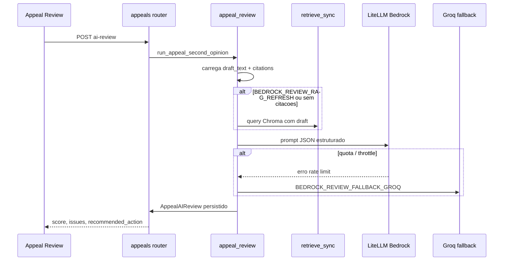

**Credenciais:** perfil AWS padrão ou variáveis de ambiente (`AWS_ACCESS_KEY_ID`, etc.). Modelo habilitado no console Bedrock da região configurada.

---

*Documento gerado para o repositório DenialFlow AI (EVA). Para atualizar o PDF: `python scripts/generate_fluxos_pdf.py`.*
